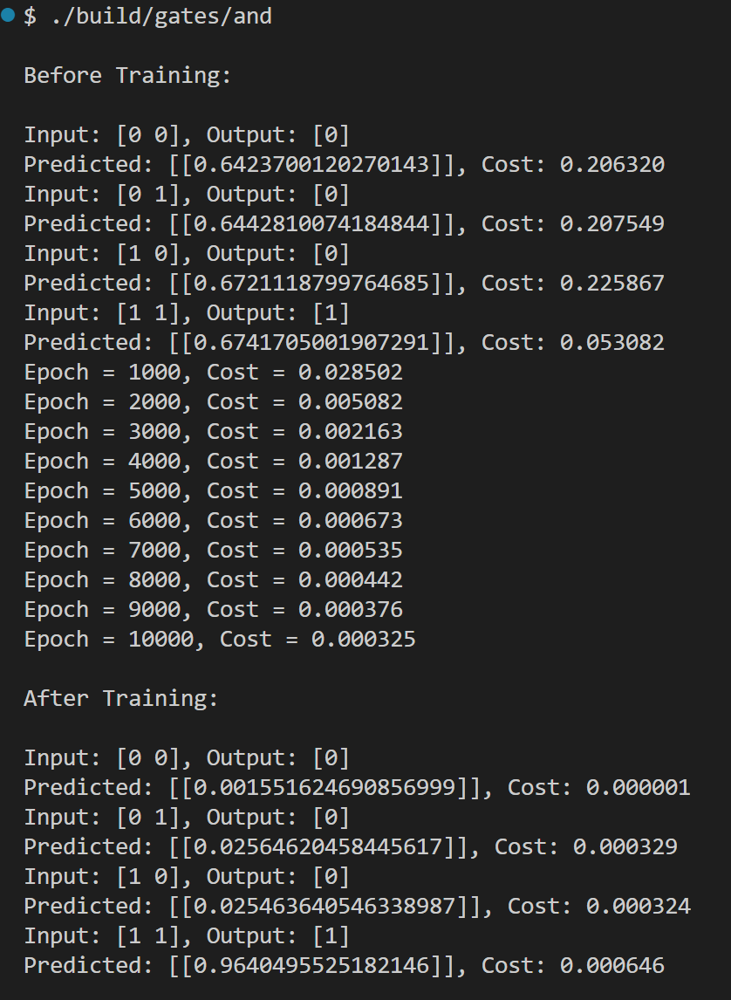

# About

> [!WARNING]  
> this project is a work in progress and not production ready

GoML is an implementation of neural networks in Golang from scratch.

The goal of this project is to learn how neural networks work behind the scenes.

## Quick Start

To build the examples use the following build script

```bash
$ ./build.sh
```

you can then run the executable for example the AND gate

```bash
$ ./build/gates/and
```

or alternatively run directly without building

```bash
$ ./examples/gates/and/and.go
```

Here is an example of what the output would look like for AND gate:


